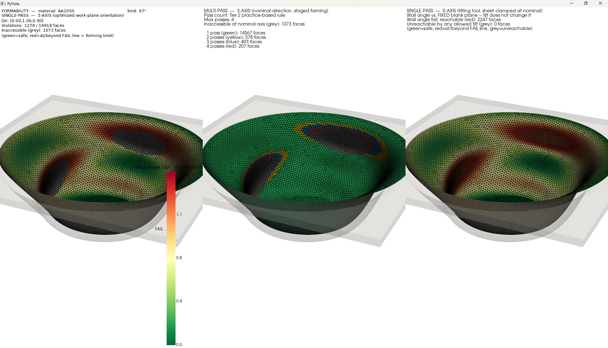

# SPIF Formability Analysis Pipeline

Internal lab tool for Single Point Incremental Forming (SPIF) formability and
forming-force analysis. Takes a STEP file, meshes it, lets you select faces
interactively, and runs 3-axis and/or 5-axis forming direction analysis with
GPU-accelerated wall angle computation, ray casting accessibility checks, and
per-face forming-force estimation.

---

## Example Output

Formability / Wall angle limit: single-pass 3-axis, multi-pass 3-axis (discrete color per pass count), single-pass 5-axis.



---

## Dependencies

- Python 3.10+
- `trimesh`, `pyvista`, `numpy`, `torch` (CUDA), `warp-lang`, `gmsh`
- CUDA GPU required for ray casting and wall angle computation

---

## Pipeline Overview

```
STEP file
   │
   ▼
step2stl.py         → STL + face map JSON  (STEP surface tag → triangle indices)
                      Uses gmsh with auto-computed mesh params to hit target
                      triangle count. Stores per-face centroids and areas.
   │
   ▼
visualize_step.py   → PyVista window: mesh with distinctly colored STEP faces + ID labels
                    → RIGHT CLICK to select/deselect faces (turns green when selected)
                    → ENTER to confirm, R to reset selection
                    → Falls back to terminal ID entry if window closed without confirming
   │
   ▼
hemisphere.py       → Fibonacci hemisphere of N directions around tool axis
                    → PyVista window: part shown inside wireframe sphere,
                      blue dots = sample directions, red arrow = hemisphere axis
                    → User confirms or enters corrected axis (directions fully
                      recomputed around new axis, re-shown until confirmed)
   │
   ▼
spif_analysis.py    → Face-normal vs. direction angle matrix  (GPU, torch)
                    → Ray casting accessibility  (GPU, Warp BVH)
                    → 3-axis: per-direction scores (each direction = work-plane
                      rotation), best orientation, violation maps
                    → 5-axis: fixed-blank-plane severity + per-face minimum-tilt
                      reachable direction → .npz + .json
                    → Multi-pass: pass counts, pure-shear sine-law thickness
                    → Forming force: per-face Fz_s estimate (Aerens et al. 2010)
                    (see "Wall Angle Reference per Strategy" below)
   │
   ▼
spif_visualize.py   → 3-axis results: two or three sequential windows
                      (baseline direction, optimized direction, predicted force)
                    → Multi-pass results: 2 or 3 subplots (passes, thickness, force)
   │
   ▼
showcase_5axis.py  → 5-axis results from saved .npz (standalone, up to eight windows)
```

---

## Usage

```bash
# Full pipeline, both modes
python main.py --step mypart.step --material AA1050 --mode both

# 3-axis only
python main.py --step mypart.step --material DC01_steel --mode 3axis

# 5-axis only, more directions
python main.py --step mypart.step --material Ti_grade5_RT --mode 5axis --dirs 500

# Skip STEP reconversion if STL already exists
python main.py --step mypart.step --stl mypart.stl --json mypart.json \
               --material AA1050 --mode both

# With finite tool radius clearance (8 ring rays + 1 center ray per direction)
python main.py --step mypart.step --material AA1050 --mode both --tool_radius 6.0
```

### Arguments

| Argument | Default | Description |
|---|---|---|
| `--step` | required | Path to STEP file |
| `--material` | `AA1050` | Material key (see table below) |
| `--mode` | `both` | `3axis`, `5axis`, or `both` |
| `--dirs` | `300` | Number of hemisphere directions |
| `--triangles` | `50000` | Target triangle count for meshing |
| `--stl` | None | Existing STL (skips reconversion) |
| `--json` | None | Existing face map JSON (skips reconversion) |
| `--tool_radius` | `0.0` | Tool radius in mm. Drives **two** things: (1) the ray-casting clearance ring — `0` = single center ray, any positive value fires an additional ring of rays offset perpendicular to the tool direction and a face is only accessible if all rays clear; (2) the forming-force tool diameter, which is **always** `2 × tool_radius` — there is no separate `--tool_diameter` flag. If left at `0`, force estimation falls back to a fixed 10mm diameter (flagged at runtime) since `2 × 0` would zero out every predicted force. See [Forming Force Estimation](#forming-force-estimation). |
| `--sheet_thickness` | `1.0` | Initial sheet thickness t0 in mm. Now also drives the thickness-dependent forming limit (see [Materials and Forming Limits](#materials-and-forming-limits)). |
| `--max_step_pass` | `10.0` | Max wall-angle step per pass for multi-pass SPIF (deg). Default matches Duflou et al. 2008 (see below). |
| `--max_tilt_deg` | `None` (placeholder) | 5-axis tool tilt bound from nominal (deg). **No literature value exists for this** — if omitted, a placeholder of 45° is used and flagged at runtime. Set this to your machine/robot's real kinematic tilt limit. |
| `--tool_length` | `None` (unchecked) | Max tool reach in mm — how far the tool tip can extend before the holder/shank collides with the part. A face can pass the ray-casting collision check (straight, unobstructed path) yet still be unreachable if the pocket it sits in is deeper than this. See [Tool Reach / Deep Pocket Check](#tool-reach--deep-pocket-check-tool_length). If omitted, this check is skipped entirely — a ray-clear but very deep pocket is reported accessible regardless of actual depth. |
| `--thinning_weight` | `None` (off) | Opt-in, **3-axis only**: fold area-averaged sine-law thinning into the work-plane orientation search (see [Thinning-Aware Direction Search](#thinning-aware-direction-search---thinning_weight)). Pass with no value for the default 0.5, or a value in `[0, 1]`. No effect on 5-axis — with the sheet clamped once, thinning does not depend on tool tilt. |

> **Note on `--tool_radius`:** the ring ray count defaults to 8 (`n_ring=8`) and is not exposed as a CLI argument — edit `_compute_accessibility` in `spif_analysis.py` to change it. Enabling tool radius noticeably increases ray casting time (×9 rays per direction by default).

### 5-axis showcase (standalone)

```bash
python showcase_5axis.py --npz mypart_5axis_db.npz --stl mypart.stl

# Limit arrow density for large meshes
python showcase_5axis.py --npz mypart_5axis_db.npz --stl mypart.stl --max_arrows 300
```

Requires a schema-v2 database (see [Regenerating old databases](#regenerating-old-5-axis-databases)).
Opens up to eight windows in sequence (Window 8 only if the `.npz` was built
with a material):

| Window | Content |
|---|---|
| 1 — Feasibility map | Root cause per face: green = feasible, red = wall angle vs. the **fixed blank plane** exceeds the limit (tool tilt cannot fix this; the count of those also unreachable is shown), orange = blocked by collision from every direction, blue = reachable only beyond the tilt bound, purple = too deep for `--tool_length`. From `infeasible_reason`. |
| 2 — Tilt map | Tilt of each reachable face's minimum-tilt collision-free direction; cyan = 0° (no tilt needed), magenta = high tilt |
| 3 — Forming severity | Side-by-side: fixed-blank-plane wall angle / limit, and sine-law thinning `1 − cos(a)` with below-critical faces outlined. One value per face — identical for every tool direction. |
| 4 — Direction field | Arrows at face centroids showing the chosen tool direction, colored by **tool-approach angle** (face normal vs. tool axis) — a kinematic diagnostic, explicitly *not* a wall angle |
| 5 — Critical faces (wall angle) | Top 15% of feasible faces closest to the forming limit (fixed-plane angle), with tool-direction rays |
| 6 — Critical faces (tilt) | Top 5% of feasible faces with highest tool tilt, with tool-direction rays |
| 7 — Multi-pass reachability | Side-by-side pass counts (Tier 2 rule) from the fixed-plane wall angle — **the same in both panels** — grey where unreachable at the nominal axis (left) vs. with any allowed tilt (right). Shows what 5-axis actually adds for multi-pass faces: reach, not fewer passes. Discrete per-count palette with exact face-count legend. |
| 8 — Predicted forming force | Per-face steady-state axial force Fz_s at the fixed-plane wall angle and t0 (Aerens et al. 2010), with the heat-assisted-material caveat if applicable. See [Forming Force Estimation](#forming-force-estimation). |

### Regenerating old 5-axis databases

Databases written before the 2026-09 wall-angle correction (schema v1, no
`schema_version` key) are refused by the showcase scripts, because their
wall-angle, thinning, force and feasibility fields were computed against the
tool direction. Rebuild them without re-running the interactive pipeline:

```bash
python regenerate_5axis_db.py --stem test2 --material DC01_steel --sheet_thickness 1.5 --tool_diameter 4
```

The script reuses the stored direction-angle, accessibility and depth
matrices, recovers the confirmed hemisphere axis from the stored Fibonacci
directions, and verifies the STL normals against the stored angles. v1 files
never ray-cast the exact axis (their "nominal" was the Fibonacci sample 3.3°
off the pole), so with CUDA it ray-casts the exact axis (identifying the
original tool radius by reproducing the stored matrix). Without CUDA it falls
back to the nearest sample and says so. For databases built with
`--tool_length`, the collision-vs-reach split (reason 2 vs 4) is also only
approximate without CUDA. Re-run with a GPU, or re-run `main.py`, for exact
values.

---

## Face Selection

The face selection window uses right-click picking:

- **RIGHT CLICK** — select / deselect a STEP face (turns bright green when selected)
- **R** — reset selection
- **ENTER** — confirm and continue
- **LEFT MOUSE** — rotate as normal

If the window is closed without confirming, falls back to terminal ID entry.

---

## Materials and Forming Limits

| Key | Forming limit @ 1.0mm (deg) |
|---|---|
| `AA1050` | 68 |
| `AA5182` | 55 |
| `AA6061_T6` | 50 |
| `DC01_steel` | 67 |
| `Ti_grade2_RT` | 50 |
| `Ti_grade2_laser` | 62 |
| `Ti_grade5_RT` | 32 |
| `Ti_grade5_laser` | 56 |
| `AZ31_RT` | 45 |
| `AZ31_warm_150C` | 59 |
| `AZ31_warm_300C` | 60 |

Base values: Duflou et al. 2018 (Int J Mater Form 11:743-773).

**Thickness dependence (new):** `get_forming_limit(material, thickness_mm)` now
scales the table value with sheet thickness:

```
limit(t) = limit_ref + 6.25 deg/mm * (t - 1.0mm)
```

`REF_THICKNESS_MM = 1.0mm` is an **assumption** — the reference thickness for
the table above is not stated in any source found; 1.0mm was chosen because
it is the most common SPIF test-sheet thickness in the literature surveyed.
The `6.25 deg/mm` slope is sourced from a **single paired data point**, not a
material-matched regression:

> Wu, Ma, Gao, Zhao, Rashed, Ma. "A novel multi-step strategy of single point
> incremental forming for high wall angle shape." *J. Manuf. Process.*
> 2020;56:697–706. doi:10.1016/j.jmapro.2020.05.009 — Al3003-O, 10mm tool:
> θmax = 71° at t0=1.2mm, 76° at t0=2.0mm → slope = (76−71)/(2.0−1.2) = 6.25°/mm.

This slope is applied generically to every material above as a best-effort
approximation. **Caveat:** the wider literature does not report this
relationship as monotonic-increasing for all materials — some studies find
formability *decreases* with increasing thickness for other material/tool
combinations. Override per-material if you have better data.

---

## Wall Angle Convention

Wall angle = angle between the face normal and the **normal of the clamped
blank plane**.

- **0°** → flat/horizontal face
- **90°** → fully vertical wall
- Forming limit = max wall angle the material can sustain before fracture

Faces exceeding the forming limit are flagged as violations.

### Wall Angle Reference per Strategy (2026-09 correction)

The sine law `t = t0·cos(a)` assumes pure shear along the axis normal to the
*original clamped blank*, so `a` must be measured against that fixed plane.
It says how far a point has been drawn from where it started, not which way
the tool points when it touches the point. The pipeline keeps two angles
apart:

| Angle | Definition | Used for |
|---|---|---|
| **Wall angle** (physical) | face normal vs. the clamped blank normal | forming limit, sine-law thinning, force |
| **Tool-approach angle** (kinematic) | face normal vs. the tool axis actually used | diagnostic only (5-axis direction field) — never fed into the forming limit, sine law or force |

| Strategy | Blank normal | Consequence |
|---|---|---|
| 3-axis, single pass | each candidate direction (work-plane rotation: the whole part is re-clamped so the blank is normal to it — Vanhove et al.) | tool axis = blank normal, so the two angles coincide and can be searched per direction |
| Multi-pass, fixed axis | the confirmed hemisphere axis | same fixed-plane angle as single pass; only the pass count differs |
| 5-axis, tilting tool | the confirmed hemisphere axis (sheet clamped once; only the tool reorients) | wall angle, thinning and force are **one value per face, independent of tilt**; tilt only changes accessibility (collision / reach / tilt bound) |

**What changed.** Earlier versions measured the 5-axis wall angle against each
candidate *tool* direction and fed that into the forming-limit check,
sine-law thinning and force. That modeled re-clamping the blank per face, so
tilting appeared to "fix" steep walls and to reduce thinning, force and pass
counts. On the same stored matrices, the old model reported `benchmark2` and
`spiftest` as 100% 5-axis-feasible; against the fixed blank plane, 12.8% and
8.7% of their area exceeds the forming limit. Any real effect of tool tilt on
local strain or force (contact conditions, friction) is a different mechanism
and is **not modeled**. Separately, the "nominal" direction used to be the
Fibonacci sample nearest the pole, 3.3° off the confirmed axis for 300
directions. `hemisphere.py` now snaps sample 0 onto the exact axis, and every
fixed-plane angle is measured against the exact axis.

### Result tiers

Every output is labeled (`METRIC_TIERS` in `spif_analysis.py`, `metric_tiers`
in the 5-axis JSON):

- **Tier 1 — established or directly geometric:** wall angle vs. forming
  limit, sine-law thickness, Aerens steady-state force, ray-cast collision /
  reach / tilt accessibility and its `infeasible_reason` attribution.
- **Tier 2 — exploratory heuristics, not validated:** wall-angle gradient,
  Flange Reservoir Ratio, the multi-pass pass-count rule. These are printed and
  displayed with an explicit `[TIER 2]` flag.

---

## 3-Axis Output

Per-direction metrics across all N hemisphere directions:

| Field | Description |
|---|---|
| `wall_violation_pct` | % of selected area with wall angle > limit |
| `blocked_pct` | % of selected area inaccessible — either occluded by ray casting (collision) or, if `--tool_length` was passed, too deep for the tool to reach (see [Tool Reach / Deep Pocket Check](#tool-reach--deep-pocket-check-tool_length)) |
| `combined_violation_pct` | wall violation OR blocked (primary score signal) |
| `draw_distance_mm` | projection extent along tool direction |
| `draw_uniformity_std` | std of centroid projections (lower = more uniform draw) |
| `combined_score` | weighted score: 0.60×violation + 0.25×draw\_dist + 0.15×uniformity |
| `best_direction` | direction minimising combined score |
| `face_difficulty` | fraction of directions where each face violates (0–1) |
| `wall_angle_gradient` | dict with per-face `gradient_deg_per_mm`, `gradient_risk` bool mask, and the threshold used — see [Wall Angle Gradient Rule (heuristic)](#wall-angle-gradient-rule-heuristic) below. `None` if `face_indices_global` wasn't passed to `analyze_3axis`. |
| `predicted_force_N` | per-face steady-state axial force at the optimized direction — see [Forming Force Estimation](#forming-force-estimation). `None` if `material_key` wasn't passed to `analyze_3axis`. |

Each candidate direction is a **global work-plane rotation** (the part is
re-clamped normal to it), so per-direction wall angles, thinning and force are
physical for that candidate. Baseline = the confirmed hemisphere axis
(`directions[0]`, no rotation).

Visualization: two or three sequential windows — baseline direction, optimized
direction (both colored by wall angle / forming limit), and predicted force
(if `material_key` was passed).

---

## 5-Axis Output

Saved as `<stem>_5axis_db.npz` and `<stem>_5axis_db.json` (schema v2).
The sheet is clamped once, normal to `blank_normal` (the confirmed hemisphere
axis); only the tool tilts. `build_5axis_database` does the GPU work (angle
matrix, ray casting); `evaluate_5axis_from_matrices` / `save_5axis_database`
are pure numpy, so `regenerate_5axis_db.py` can re-evaluate a saved file.

**Severity — one value per face, fixed blank plane (Tier 1):**

| Array | Description |
|---|---|
| `blank_wall_angles` | Wall angle vs. the fixed blank normal |
| `wall_ok` | `blank_wall_angles ≤ forming_limit_deg` |
| `sine_law_thickness_mm` / `thinning_pct` | `t0·cos(a)` and `1 − cos(a)` (%) |
| `predicted_force_N` | Aerens Fz_s at the fixed-plane wall angle and t0 (only if a material was given) |

**Accessibility — varies with tool direction (Tier 1, geometric):**

| Array | Description |
|---|---|
| `direction_angles_all` | `(n_faces × n_dirs)` face-normal vs. direction angle. = wall angle only under a 3-axis work-plane rotation; in 5-axis it is the tool-approach angle (diagnostic only) |
| `depth_proj_all` | Centroid projection depth per face per direction |
| `accessible` | Ray-cast accessibility (collision-clear AND within tool reach), `(n_faces × n_dirs)` |
| `nominal_accessible` | Accessibility at the blank normal (untilted tool) |
| `access_ok` | Some collision-free, within-reach direction exists within `max_tilt_deg` |
| `best_dir_indices` | Minimum-tilt such direction per face (points at the nominal direction if `access_ok` is False) |
| `tilt_needed_deg` | Tilt of that direction from the blank normal (`NaN` if unreachable) |
| `approach_angle_at_best_deg` | Tool-approach angle at that direction (kinematic diagnostic, `NaN` if unreachable) |
| `reach_depth_mm`, `blocked_by_reach`, `collision_ok` | Only with `--tool_length`: insertion depth, collision-clear-but-too-deep mask, collision-only mask |

**Combined:**

| Array | Description |
|---|---|
| `is_feasible` | `wall_ok AND access_ok` |
| `infeasible_reason` | 0 feasible, 1 wall angle vs. fixed blank plane exceeds limit (tilt cannot fix it: redesign / multi-pass / different clamping), 2 blocked by collision from every direction, 3 reachable only beyond the tilt bound, 4 collision-clear but too deep for `--tool_length` everywhere. Code 1 takes priority. |
| `access_reason` | The accessibility code (0/2/3/4) alone, so a face failing both is still reported as unreachable |

Settings are saved alongside (`forming_limit_deg`, `max_tilt_deg`,
`tool_length_mm`, `material_key`, `sheet_thickness_mm`, `tool_diameter_mm`,
`schema_version`). The per-face JSON mirrors these fields and adds
`metric_tiers`, `force_caveat`, the reason-code legend, and notes that
distinguish wall angle from tool-approach angle.

### 5-axis tool tilt bound (placeholder)

`evaluate_5axis_from_matrices` searches only directions within `max_tilt_deg`
of the blank normal when picking each face's tool direction. **No literature value
was found for this bound** — real 5-axis/robot tilt limits are
machine/tool-holder specific (workspace limits, wrist singularities), not a
material or forming-physics constant. If `--max_tilt_deg` is not supplied,
`MAX_TILT_DEG_PLACEHOLDER = 45°` in `spif_analysis.py` is used, and a warning
is printed at runtime. **Set `--max_tilt_deg` to your actual machine's
kinematic tilt limit before trusting these results.**

---

## Multi-Pass Output

`analyze_multipass()` in `spif_analysis.py`. All angles are measured against
the fixed blank normal (the confirmed hemisphere axis). Pass-count visualizations
(`visualize_multipass_results` Subplot 1, and `showcase_5axis.py` Window 7)
use a **discrete, maximally-distinct color per integer pass count** — not a
continuous gradient/heatmap — plus a text legend giving the exact face count
for each pass number (`_discrete_int_lut`), so you're reading whole numbers
off a legend rather than eyeballing shades on a colorbar.

| Field | Description |
|---|---|
| `needs_multipass` | fixed-plane wall angle exceeds the forming limit |
| `target_wall_angles` | wall angle per face against the fixed blank normal |
| `passes_required` | `1 + ceil(excess_angle / max_step_per_pass_deg)` — **Tier 2** practice-based rule |
| `final_thickness_mm` | pure-shear sine-law thickness `t0·cos(a_final)` — path-independent (see below) |
| `below_critical_thickness` | `final_thickness_mm < t0·tc_ratio`. Because `tc_ratio = cos(forming_limit)`, this is exactly `needs_multipass`: it means "the geometry-only sine law cannot certify this wall", **not** a calibrated multi-pass fracture prediction. (Renamed from `fracture_risk`.) |
| `critical_thickness_mm`, `tc_ratio` | the threshold used |
| `reservoir_ratio` | flat-flange area / steep-wall area — **Tier 2** unvalidated heuristic (arbitrary 20° flatness threshold) |
| `predicted_force_N` | single-pass-equivalent force at the fixed-plane wall angle and **t0** (the conditions the Aerens model was fitted on). Per-pass multi-pass forces are not modeled. `None` if `material_key` wasn't passed. |
| `force_caveat` | heat-assisted-material caveat string, or `None` |

**Thickness is not compounded across passes (2026-09 correction).** Earlier
versions computed `t = t0·∏cos(a_k)` over the staged angles. That contradicts
the sine law's own derivation: under pure shear along the fixed blank normal,
the axial thickness stays `t0` through every pass, so the normal thickness is
`t0·cos(a_final)` no matter how many passes are used. Compounding treated each
intermediate wall as a new flat blank and grossly over-predicted thinning
(e.g. 67°→76°→85° gave 0.8% of t0 instead of 8.7%). The pure-shear value is a
first-order estimate. Real multi-step forming departs from pure shear
(material is drawn from the base/flange), and the ESAFORM benchmark notes that
multi-stage forming "does not automatically result in more uniform thickness
distributions, and it can even lead to increased thinning in critical
areas". So a geometry-only model can say how many stages a wall needs, but
not certify that they will succeed.

**Nominal direction (`nominal_dir`) — fixed bug.** `target_wall_angles` (and
everything downstream: `needs_multipass`, `passes_required`,
`final_thickness_mm`, `below_critical_thickness`, `predicted_force_N`) is measured
against `nominal_dir`, which **must be the same confirmed hemisphere axis**
3-axis/5-axis use — `main.py` passes its `hemi_axis`, and `spif_showcase_all.py`
passes the saved `.npz`'s `blank_normal`. Previously `analyze_multipass()`
had no such parameter at all and silently always used a hardcoded `[0,1,0]`
(global Y), regardless of what hemisphere axis the user actually confirmed
interactively — on any part using a non-default axis, every multi-pass number
(including force) disagreed with the rest of the pipeline without any
warning. If `nominal_dir` is omitted entirely (direct/library use only —
both callers in this repo always pass it now), a warning is printed and it
falls back to `[0,1,0]` for backward compatibility.

**Step angle (Δα) per pass** — default `max_step_per_pass_deg = 10°`, matching
the 5-step truncated-cone strategy (wall angle 50° → 90° in 10° increments) in:

> Duflou JR, et al. "Process window enhancement for single point incremental
> forming through multi-step toolpaths." *CIRP Annals.* 2008;57(1):253–256.

This reflects common experimental practice, not a codified universal rule —
no source was found giving a general closed-form `N = f(Δα)`.

**Critical (fracture) thickness ratio** — `tc_ratio` is now **derived per
material** as `sin(90° − forming_limit_deg)` instead of a flat constant,
rather than passed a fixed `0.2`. This ties fracture directly to the sine-law
thickness at the material's own established forming-limit angle — the
thickness at which that material is documented to fail. Cross-checked against
an independent source:

> US Patent 12,358,093, "Incremental sheet forming systems and methods for
> forming structures having steep walls" — states walls steeper than 60°
> generally infeasible, with the sheet thinned to "less than half" of t0 at
> that point. `sin(90° − 60°) = sin(30°) = 0.50`, matching the pure sine-law
> figure exactly.

Pass an explicit `tc_ratio` to `analyze_multipass()` to override the derived
value.

---

## Forming Force Estimation

**Read this as a relative effort proxy, not an exact force prediction.** It's
a steady-state model (see below), so it's best used as an order-of-magnitude,
per-face comparison of where the process pushes hardest — with a safety
margin applied for real transient/peak loads, not as an absolute limit.

`estimate_forming_force_fz()` in `spif_analysis.py` computes the steady-state
axial force Fz_s (the force along the tool axis, in N) per face, from:

> Aerens R, Eyckens P, Van Bael A, Duflou JR. "Force prediction for single
> point incremental forming deduced from experimental and FEM observations."
> *Int J Adv Manuf Technol.* 2010;46:969–982. doi:10.1007/s00170-009-2160-2

The paper derived dedicated regression equations for five tested materials
(AA3003, AA5754/AlMg3, DC01, AISI 304, 65Cr2) plus a **generalized formula**
that predicts Fz_s for *any* material using only its tensile strength Rm:

```
Fz_s = 0.0716 * Rm * t^1.57 * dt^0.41 * dh^0.09 * a * cos(a)
```

where `t` = sheet thickness (mm), `dt` = tool diameter (mm), `dh` = scallop
height (mm), `a` = wall angle (**degrees** — used both as a bare value and
inside `cos(radians(a))`, per the paper's own convention), and `Rm` in N/mm².
Generalized-formula precision per the paper: ≤15% error in 77% of test cases,
validated against a material (Al 2024) not used to fit it.

Only `DC01_steel` in this project matches one of the paper's five directly
tested materials, so it uses the dedicated DC01 regression instead (their
Eq. 13, ±13.4%):

```
Fz_s = 16.26 * t^1.35 * dt^0.48 * dh^0.12 * a^1.11 * cos(a)
```

**Non-monotonic behavior (from the paper, not a bug):** Fz_s ∝ a·cos(a),
which *rises* with wall angle up to roughly 50–60° and then *falls* back
toward zero at 90°. A near-vertical wall can show a **lower** predicted
steady-state force than a 55° wall — this is the paper's own finding, not an
artifact. The paper's *peak* force Fz_p keeps rising monotonically instead,
but was only given per-material for their five tested alloys (no generalized
formula), so it is **not implemented here**.

### Material tensile strength (Rm)

None of this project's 11 materials exactly match the paper's five tested
alloys except `DC01_steel`, whose Rm = 357 N/mm² is taken directly from the
paper's own Table (Section 5) — an exact match, not an external lookup.
Every other Rm value below was sourced separately (typical/handbook values,
not measurements of your actual sheet stock):

| Material | Rm (MPa) | Source |
|---|---|---|
| `AA1050` | 70 | EN 573-3 O-temper spec range 60–80 MPa, midpoint |
| `AA5182` | 275 | O-temper automotive body sheet (typical; alloy spans 280–420 MPa across all tempers) |
| `AA6061_T6` | 310 | T6 typical (290 MPa minimum spec) |
| `DC01_steel` | 357 | Aerens et al. 2010, Section 5 (exact match — their own test material) |
| `Ti_grade2_RT` | 345 | CP-Ti Grade 2, ASTM minimum spec (~50 ksi) |
| `Ti_grade2_laser` | 345 | Same as RT — see heat-assisted caveat below |
| `Ti_grade5_RT` | 950 | Ti-6Al-4V, annealed, room temperature |
| `Ti_grade5_laser` | 950 | Same as RT — see heat-assisted caveat below |
| `AZ31_RT` | 267 | AZ31 sheet, room temperature |
| `AZ31_warm_150C` | 267 | Same as RT — see heat-assisted caveat below |
| `AZ31_warm_300C` | 267 | Same as RT — see heat-assisted caveat below |

**Heat-assisted materials (`_laser`, `_warm_*`) are a KNOWN OVERESTIMATE.**
The force model has no temperature term, and no forming-temperature-specific
Rm was found for these exact alloys/conditions, so the room-temperature Rm is
reused. General elevated-temperature tensile studies (not SPIF-specific) show
substantial softening with heating — e.g. Ti-6Al-4V tensile strength dropping
roughly 40% by 500°C in unrelated elevated-temperature studies — so treat
predicted force for `_laser`/`_warm_*` materials as a conservative **upper
bound**, not a point estimate.

### Tool diameter and scallop height

Tool diameter is **not** an independent parameter — it's always `dt = 2 ×
tool_radius`, derived from `--tool_radius` (the same one used for the
ray-casting clearance ring). If `--tool_radius` is left at its default of `0`
(meaning "no clearance ring"), force estimation falls back to a fixed
10mm — the Aerens et al. paper's own "standard" test value — since `2 × 0`
would otherwise zero out every predicted force; this fallback is flagged at
runtime. Pass `--tool_radius` with your real tool's radius for a meaningful
force estimate.

Scallop height `dh` is **not** a CLI parameter — it's a fixed placeholder,
`SCALLOP_HEIGHT_PLACEHOLDER_MM = 0.010`, the midpoint of the paper's own
tested range (0.005–0.015 mm). This was a deliberate project decision, not a
literature gap: all of the paper's fitted scallop-height exponents are small
(0.07–0.14), i.e. force is only weakly sensitive to it, so a fixed
representative value was judged not worth the added parameter surface.

### Where it's computed

| Mode | Wall angle used | Thickness used |
|---|---|---|
| 3-axis (`analyze_3axis`) | wall angle at the optimized work-plane orientation (blank re-clamped normal to it) | t0 |
| 5-axis (`evaluate_5axis_from_matrices`) | fixed blank-plane wall angle (`blank_wall_angles`) — independent of tool tilt | t0 |
| Multi-pass (`analyze_multipass`) | fixed blank-plane wall angle (final target) | t0 (single-pass-equivalent) |

The force model always receives the **physical** wall angle and the initial
thickness — the conditions it was fitted on. It never receives a tool-approach
angle. 5-axis and multi-pass therefore give the same force per face; they
differ in reachability and pass count, not force. (Before the 2026-09
correction, 5-axis used a per-tool-direction angle and multi-pass used the
compounded, grossly over-thinned thickness, which made its force too low.)
Every force output carries the heat-assisted-material caveat (`force_caveat`)
when applicable, in terminal output, visualizations and the 5-axis JSON.

All three are opt-in via a `material_key` argument; omitting it leaves
`predicted_force_N` as `None` everywhere.

---

## Wall Angle Gradient Rule (heuristic)

`compute_wall_angle_gradient()` in `spif_analysis.py` flags faces whose wall
angle changes sharply relative to a topologically adjacent face (mesh
`face_adjacency`) over a short centroid-to-centroid distance, as a proxy for
local strain-concentration risk. It is called automatically inside
`analyze_3axis` (using the wall angle at the optimized direction) whenever
`face_indices_global` is provided.

**This is an unsourced heuristic, not a validated rule.** No standardized
"wall angle gradient" rule or numeric threshold exists in the SPIF literature
surveyed. The closest related research area is VWACF (Varying Wall Angle
Conical Frustum) fracture testing, which shows fracture depends on how wall
angle varies with position, not only its local value — but that literature
does not supply a portable numeric limit. `WALL_ANGLE_GRADIENT_THRESHOLD_DEG_PER_MM
= 15.0` is an arbitrary placeholder; treat `gradient_risk` as a tunable
diagnostic, not a pass/fail criterion, and retune the threshold per mesh
resolution.

**Current status: print-only.** The result is in `analyze_3axis`'s returned
dict (`wall_angle_gradient`) and summarized to the terminal, but there is no
PyVista visualization for it yet — a plausible next step would be a third
window in `visualize_3axis_results` coloring flagged faces.

---

## Ray Casting

Uses NVIDIA Warp BVH mesh for GPU-accelerated occlusion checks.

Ray fired from each face centroid, offset by `face_normal × ε + direction × ε`
to avoid self-intersection. If the ray hits geometry closer than `0.9 × ray_length`
(2 × bbox diagonal), the face is marked blocked (undercut or occluded).

With `--tool_radius > 0`, an additional ring of N rays is fired offset perpendicular
to the tool direction by the given radius, starting one full `--tool_radius` further
along the tool direction than the center ray (not from the same height) -- e.g.
`--tool_radius 2` fires the ring origins +2mm towards the hemisphere direction from
the face centroid, modeling the tool's cylindrical rim clearing the surface a bit
ahead of the tip. A face is only accessible if all rays (center + ring) clear.
Processed in batches to stay within GPU memory.

---

## Tool Reach / Deep Pocket Check (`--tool_length`)

The collision check above only answers "is the straight-line path clear?" — it
has no notion of how long the physical tool actually is. A ray fired straight
down a deep, narrow, straight-walled pocket can travel a long way without
hitting anything (the walls run parallel to the ray) and come back "clear,"
even though no real tool's shank is that long before the holder itself would
hit the rim of the pocket.

`--tool_length` (mm) adds a second, independent blocking criterion on top of
the collision check, applied per face per direction:

1. For every face+direction pair, the **required insertion depth** is
   computed as a projection, not a ray hit (`_compute_reach_depth` in
   `spif_analysis.py`): `depth = (highest point of the WHOLE part's vertices,
   projected onto the direction) − (this face's own projection onto the
   direction)`. In other words: how far below the part's own outer extent,
   along this direction, does this face sit.
2. If that depth exceeds `--tool_length`, the face is marked **blocked by
   reach**, distinct from being blocked by collision.

An earlier version fired a second ray in reverse (from outside the part back
toward the face) instead of using this projection. That approach had a blind
spot: for a pocket whose walls run parallel to the direction — exactly the
common case for an *accessible* (ray-clear) face, since a ray never
intersects a surface it's exactly parallel to — the reverse ray sailed
straight through without hitting the walls and landed back on the face's own
triangle, reporting a depth of **0mm regardless of true pocket depth**. The
projection method has no such blind spot, since it never depends on hitting
(or failing to hit) anything — only on where the face sits relative to the
part's actual extent. Trade-off: it can *overestimate* depth for a face on
an easily-reached sub-feature that merely sits "below" some unrelated tall
feature elsewhere on the part along the same direction — it's a whole-part
envelope bound, not a true local pocket depth.

Final accessibility is `collision-clear AND within tool reach`. If
`--tool_length` is omitted, this second check is skipped entirely (same
behavior as before this feature existed) and a warning is printed.

In the 5-axis database (`build_5axis_database`), this adds a new
`infeasible_reason` code (`4`) distinguishing "ray-clear but too deep for
the tool" from `2` ("blocked by collision") — see [5-Axis Output](#5-axis-output).
In 3-axis and multi-pass, it's folded directly into the existing `accessible`
/ `blocked_pct` numbers (no separate reason breakdown there).

---

## Thinning-Aware Direction Search (`--thinning_weight`)

By default, the 3-axis work-plane orientation search minimizes
wall-violation/draw-distance/uniformity and ignores how thin the sheet ends
up. `--thinning_weight` (opt-in; `[0, 1]`, default `0.5` if passed with no
value) folds the area-averaged sine-law thinning fraction `1 - cos(a)` into
that score. The original three terms keep their relative 60/25/15
proportions but share `1 - thinning_weight` of the total. This is valid
because each 3-axis candidate re-clamps the whole part, so thinning really
does change with the candidate.

**5-axis: removed (2026-09 correction).** The earlier 5-axis variant blended
"thinning at the tool direction" into each face's direction choice. With the
sheet clamped once, thinning is fixed by the blank plane and does not depend
on tool tilt, so there is nothing to optimize. 5-axis now always picks the
minimum-tilt reachable direction, and `--thinning_weight` has no effect there.

---

## Debug Tools

```bash
# Single-direction ray cast debug — shows green/red faces + ray lines
python debug_raycast.py --stl mypart.stl --json mypart.json

# Optionally pass direction directly
python debug_raycast.py --stl mypart.stl --json mypart.json --dir 0,0,-1

# At the end, option to run full hemisphere accessibility debug
# (two-panel: face accessibility fraction + hemisphere direction quality map)
```

---

## References

- Duflou et al. 2018, "Single point incremental forming: state-of-the-art and prospects", Int J Mater Form 11:743-773 (https://link.springer.com/article/10.1007/s12289-017-1387-y)
- Duflou JR, et al. 2008, "Process window enhancement for single point incremental forming through multi-step toolpaths", CIRP Annals 57(1):253-256 — source for the `max_step_per_pass_deg = 10°` default.
- Wu, Ma, Gao, Zhao, Rashed, Ma. 2020, "A novel multi-step strategy of single point incremental forming for high wall angle shape", J. Manuf. Process. 56:697-706, doi:10.1016/j.jmapro.2020.05.009 — source for `THICKNESS_SLOPE_DEG_PER_MM = 6.25`.
- US Patent 12,358,093, "Incremental sheet forming systems and methods for forming structures having steep walls" — cross-check for the sine-law-derived critical thickness ratio.
- Vanhove H, et al., process window extension for SPIF through optimal work plane rotation — basis for interpreting each 3-axis candidate direction as a global work-plane rotation (full citation to be completed).
- ESAFORM 2024 SPIF benchmark — source of the caveat that multi-stage forming "does not automatically result in more uniform thickness distributions, and it can even lead to increased thinning in critical areas" (full citation to be completed).
- No literature source exists (surveyed 2026-09) for a SPIF-specific 5-axis tool tilt bound or a numeric "wall angle gradient" threshold — both are flagged as unsourced placeholders/heuristics in `spif_analysis.py` and above.
- Aerens R, Eyckens P, Van Bael A, Duflou JR. 2010, "Force prediction for single point incremental forming deduced from experimental and FEM observations", Int J Adv Manuf Technol 46:969-982, doi:10.1007/s00170-009-2160-2 — source for the forming force model, the generalized Rm-only formula, and DC01_steel's dedicated regression and Rm value.
- Material tensile strength (Rm) sources for the [material table](#material-tensile-strength-rm): EN 573-3 (AA1050), 5182 aluminium alloy datasheets/Wikipedia (AA5182), standard 6061-T6 specification (AA6061_T6), ASTM CP-Ti Grade 2 minimum spec (Ti_grade2), Ti-6Al-4V annealed datasheets (Ti_grade5), AZ31 sheet room-temperature tensile studies (AZ31). None were measured on this project's actual sheet stock.

---

## At a Glance

**What it does.** Takes a STEP model of a part and screens it for Single Point
Incremental Forming (SPIF) *before* toolpath programming — checking whether
it can be formed at all, in what orientation, over how many stages, and how
much force it will demand — instead of finding that out on the machine.

**Inputs.**
- A STEP file, meshed automatically to a target triangle count (`--triangles`).
- The region to analyze — picked interactively by right-clicking faces in a
  3D view (not necessarily the whole part).
- The tool's approach direction (hemisphere axis) — confirmed interactively,
  with a sampled hemisphere of candidate directions around it.
- Material (one of 11 built-in aluminum/steel/titanium/magnesium alloys) and
  sheet thickness.
- Tool radius (drives both ray-casting clearance and the force model's tool
  diameter), and mode-specific knobs: hemisphere direction count, max
  wall-angle step per multi-pass stage, 5-axis tilt bound.

**Metrics it shows.**
| Metric | What it tells you |
|---|---|
| Wall angle vs. forming limit (Tier 1) | Will this wall thin to fracture? Measured against the clamped blank plane (material- and thickness-dependent limit) |
| Sine-law thickness (Tier 1, first-order) | Roughly how thin does the wall get (pure shear, `t0·cos(a)`)? |
| Accessibility (Tier 1, ray casting) | Can the tool reach this face from this direction — or is it blocked by collision, or (with `--tool_length`) too deep? |
| Tilt needed (5-axis) | How far must the tool tilt from nominal to *reach* this face? (Tilt does not change the wall angle.) |
| Infeasibility reason (Tier 1) | *Why* a face fails: wall angle / collision / tool reach / tilt bound — each points to a different fix |
| Pass count (multi-pass, Tier 2) | How many stages a wall beyond the single-pass limit needs (practice-based rule; success not certifiable from geometry) |
| Predicted forming force (Tier 1) | Relative effort: how hard the tool pushes at this face (Aerens et al. 2010); upper bound for heat-assisted materials |
| Wall angle gradient / Flange Reservoir Ratio (Tier 2) | Unvalidated heuristics for strain concentration / material feeding |

**Checking forming difficulty.** Run the pipeline in `--mode both` and read
the results top to bottom:
1. **3-axis, single direction** — the baseline vs. optimized-direction
   windows show what fraction of the selected area violates the wall-angle
   limit (by color) or is blocked (by the printed combined percentage) at a
   single fixed tool direction. Little to no red/orange → formable as-is.
2. **5-axis feasibility map** — shows *why* each face fails: wall angle
   beyond the limit (red: tool tilt can't help → redesign, multi-pass, or
   re-clamp), blocked (orange), too deep (purple), or just outside your tilt
   budget (blue). Reachable-with-tilt faces show how much tilt each needs.
3. **Multi-pass** — for walls beyond the single-pass limit, the pass-count
   map shows how many stages are needed, and Window 7 of the 5-axis showcase
   shows which of those walls a tilting tool can actually reach. The
   sine-law thickness map flags them all as below critical: the geometry-only
   model cannot certify multi-pass success.
4. **Predicted force** — cross-check the hardest-to-form regions against the
   force maps: high force and high wall-angle difficulty don't always
   coincide (see the non-monotonic force note above), so a face can be
   "geometrically easy" but still a high-force outlier, or vice versa.
